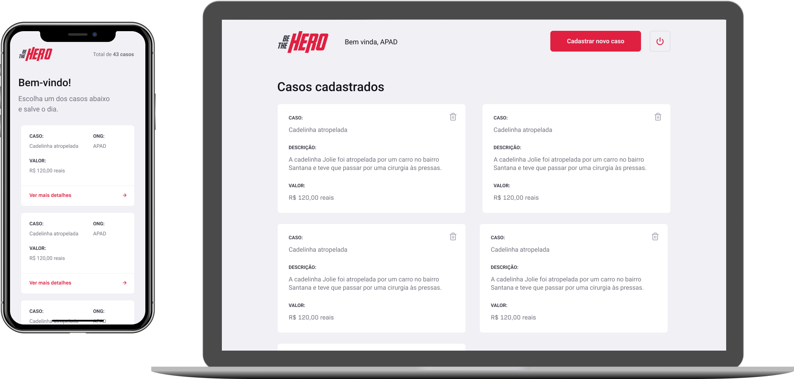

<h1 align="center">
  
</h1>

<h3 align="center">
  Be The Hero - Conecte sua ONG com pessoas que desejam lhe ajudar.
</h3>

  

  

  

  

  
  
  

## 🦸‍♀️ Projeto

Com essa aplicação as ONGs podem informar sobre seus casos, necessidades e o valor necessário para solucionar o problema. Com essas informações, toda a sociedade pode contruibir com um determinado caso e ser o herói para aquela ONG. Por meio da interação entre ONG e comunidade: o aumento da velocidade e eficácia na resolução dos problemas.

## 🚀 Tecnologias

Esta aplicação foi desenolvida com as tecnologias abaixo:
- [Node.js](https://nodejs.org/en/)
- [ReactJS](https://reactjs.org/)
- [React Native](https://reactnative.dev/)
- [Expo](https://expo.io/)
- [Express](https://expressjs.com/pt-br/)
- [Celebrate](https://github.com/arb/celebrate)
- [SQLite](https://www.sqlite.org/)
- [Jest](https://jestjs.io/)
- [SuperTest](https://github.com/visionmedia/supertest)
- [Nodemon](https://nodemon.io/)
- [Sucrase](https://github.com/alangpierce/sucrase)
- [React Router DOM](https://reacttraining.com/react-router/)
- [React Navigation](https://reactnavigation.org/)
- [React Icons](https://react-icons.netlify.com/#/)
- [Styled Components](https://styled-components.com/)
- [Axios](https://github.com/axios/axios)

##  Semana OmniStack 11.0

A [Semana OmniStack](https://rocketseat.com.br/week/inscricao/11.0) é um evento 100% online e gratuito, onde a [Rocketseat](https://github.com/rocketseat) junto com seu CTO [Diego Fernandes](https://github.com/diego3g) e mais toda a comunidade, desenvolvem uma aplicação completa, desde o banco de dados, back-end, até o front-end web e mobile, tudo isso utilizando a stack JavaScript, ou seja, Node.js no back-end, ReactJS para web e React Native para mobile.

---

Feito com ♥ by [Pedro Leinar](https://www.linkedin.com/in/pedroleinar/)
